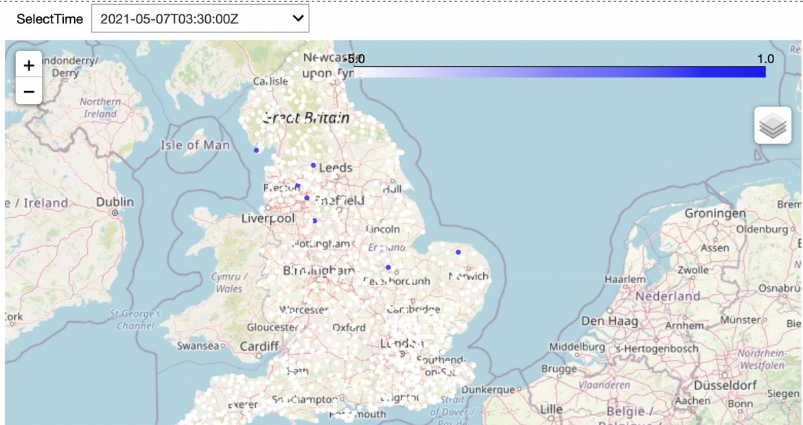
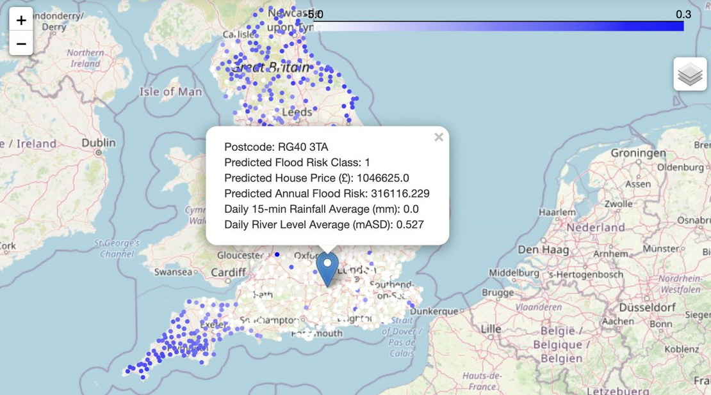

# Flood Risk Prediction tools

## Installation Guide

How to install Flood tool's bundle of software  

### Ensure Python3 is installed on your machine 

Unix/MacOS: ``python3 --version``  
Windows: ``py- -version``  

### Ensure pip can be ran from the command line

Check this by running the following in your command line  

Unix/MacOS: ``python3 -m pip --version``  
Windows:``py -m pip --version``  

and ensure it is up to date  

Unix/MacOS:``python3 -m pip install --upgrade pip setuptools wheel``  
Windows: ``py -m pip install --upgrade pip setuptools wheel``  


### Create a virtual environment and activate it (optional). 

This will allow for the flood tool package to be installed in an isolaed location for your particualr application. Rather than it being installed globally.  

Do this within the directory you want the package to be located on your machine.  

Unix/MacOS: ``python3 -m venv flood_tool_env``  
            ``source tutorial_env/bin/activate``   
Windows: ``python3 -m venv flood_tool_env``  
         ``tutorial_env\Scripts\activate``  

### Clone flood_tool package from github 

Firstly, ensure git is installed on your machine  

Unix/MacOS:``git --version``  
Windows:``git version``  

If not installed, navigate to the installer.  

mac: https://sourceforge.net/projects/git-osx-installer/files/git-2.23.0-intel-universal-mavericks.dmg/download?use_mirror=autoselect  
Windows: https://sourceforge.net/projects/git-osx-installer/files/git-2.23.0-intel-universal-mavericks.dmg/download?use_mirror=autoselect  

Once git is installed on your machine. Clone the Flood Tool package into your directory from the command line using:  

``git clone https://github.com/ese-msc-2021/ads-deluge-wye.git``  

This will target the flood tool repository and create a clone (or copy) of the target repository in your machine.  

There should now be a directory called ``ads-deluge-wye`` which contains all the files needed for the package.  

### Installng requirements

Naviate to the package' directory   

``cd ds-deluge-wye``  

Now install all the requirements needed for the package  

``pip install .``  

You are now set up to use the Flood Tool package  
## User instructions

Open jupyter notebook running following command in your terminal (it was installed with the package), in the directory where the flood tool package is located.  

``jupyter notebook``  

You can now interact with the notebooks that will visualise the data and interact with the package. 

## risk_house_visualiser.ipynb
### Note: Please run the cell in order

This notebook provides interactive plots that visualise the risk label and median house prices across England.  

This will highlight high flood risk zones or high impact areas, as well as areas where flooding is more likely.     


The notebook also allows the user to select a postcode from a list and plot it.  


(The code used mainly comes from the house_flood_interface.py file to make the visualiser to more clean.)  

### Plotting the Maps for flood_risk and house_price
This generates an interactive plot of the flood risk on a scale of 1 to 10 for postcodes in postcodes_sampled.csv, as well as the distribution of median house prices for these postcodes.  


### Plotting the Maps for flood_risk and house_price with postcode markers
We used a widget package to allow user to select a postcode from the postcodes_unlabelled.csv and use the machine learning methods to predict the risk and housing prices at a specific postcode. The choice of the model can be changed in the house_flood_interface.py


### river_rain_visualiser.ipynb

This notebook produces maps for daily average raifall and river level data for a wet day and typical day. The data is plotted on a log10 scale for better visualization. The first map below shows the wet day rainfall map, and the second shows the wet day river level map.
 


The notebook also contains interactive map allowing the user to choose a time and see rainfall situation of the UK.


Then, the notebook calculates a regional rainfall and river data average (50 km circle) around any given location. Finally, the notebook contains another interactive map where the user can choose a postcode, and a map marker would show up containing predicted flood risk, house price, regional average rainfall and river data. The background map is wet day rainfall.



### holoview.ipynb

This notebook allows the user to analyse how out rainfall and river data changes through time across England   

This first plot allows the user to analyse rainfall levels and nvestigate how it changes with dateTime and rainfall class.   


The second plot allows the user to visualise how the distribution of rain classes vary across England through time.   


## Documentation

The code includes [Sphinx](https://www.sphinx-doc.org) documentation. On systems with Sphinx installed, this can be build by running. 

```
python -m sphinx docs html
```

then viewing the generated `index.html` file in the `docs/html` directory in your browser.


### Testing

The tool includes several tests, which you can use to checki its operation on your system. With [pytest](https://doc.pytest.org/en/latest) installed, these can be run with

```bash
python -m pytest flood_tool
```

### Reading list

 - (A guide to coordinate systems in Great Britain)[https://webarchive.nationalarchives.gov.uk/20081023180830/http://www.ordnancesurvey.co.uk/oswebsite/gps/information/coordinatesystemsinfo/guidecontents/index.html]

 - (Information on postcode validity)[https://assets.publishing.service.gov.uk/government/uploads/system/uploads/attachment_data/file/283357/ILRSpecification2013_14Appendix_C_Dec2012_v1.pdf]
