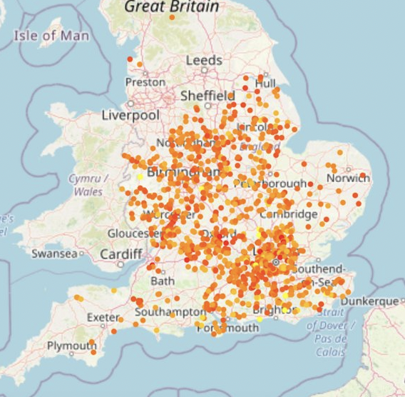

##########
Flood Tool
##########

This package implements a flood risk prediction and visualization tool.

Indices and tables
==================

* :ref:`genindex`
* :ref:`modindex`

Installation Instructions
=========================

How to install Flood tool's bundle of software 

Ensure Python3 is installed on your machine 
*******************************************

| Unix/MacOS: 
| ``python3 --version``
| Windows: 
| ``py- -version`` 

Ensure pip can be ran from the command line
*******************************************

| Check this by running the following in your command line

| Unix/MacOS: 
| ``python3 -m pip --version`` 
| Windows: 
| ``py -m pip --version`` 

| and ensure it is up to date

| Unix/MacOS: 
| ``python3 -m pip install --upgrade pip setuptools wheel`` 
| Windows: 
| ``py -m pip install --upgrade pip setuptools wheel`` 

Create a virtual environment and activate it (optional)
********************************************************

| This will allow for the flood tool package to be installed in an isolaed location for your particualr application. Rather than it being installed globally.

| Do this within the directory you want the package to be located on your machine.

| Unix/MacOS: 
| ``python3 -m venv flood_tool_env``
| ``source tutorial_env/bin/activate`` 
| Windows: 
| ``python3 -m venv flood_tool_env`` 
| ``tutorial_env\Scripts\activate`` 

Clone flood_tool package from github
************************************

| Firstly, ensure git is installed on your machine 

| Unix/MacOS: 
| ``git --version``
| Windows: 
| ``git version``

| If not installed, navigate to the installer. 

| mac: https://sourceforge.net/projects/git-osx-installer/files/git-2.23.0-intel-universal-mavericks.dmg/download?use_mirror=autoselect
| Windows: https://sourceforge.net/projects/git-osx-installer/files/git-2.23.0-intel-universal-mavericks.dmg/download?use_mirror=autoselect

| Once git is installed on your machine. Clone the Flood Tool package into your directory from the command line using: 

| ``git clone https://github.com/ese-msc-2021/ads-deluge-wye.git``

| This will target the flood tool repository and create a clone (or copy) of the target repository in your machine. 

| There should now be a directory called ``ads-deluge-wye`` which contains all the files needed for the package. 

Installng requirements
**********************

| Naviate to the package' directory

| ``cd ds-deluge-wye``

| Now install all the requirements needed for the package 

| ``pip install .``

| You are now set up to use the Flood Tool package 

Usage guide 
===========

Open jupyter notebook running following command in your terminal (it was installed with the package), in the directory where the flood tool package is located.  

``jupyter notebook``  

You can now interact with the notebooks that will visualise the data and interact with the package.

risk_house_visualiser.ipynb
---------------------------
This generates an interactive plot of the flood risk on a scale of 1 to 10 for postcodes in postcodes_sampled.csv, as well as the distribution of median house prices for these postcodes.  

| This notebook provides interactive plots that visualise the risk label and median house prices across England.  

| This will highlight high flood risk zones or high impact areas, as well as areas where flooding is more likely.     

| The notebook also allows the user to select a postcode from a list and plot it.  

| (The code used mainly comes from the house_flood_interface.py file to make the visualiser to more clean.)  

Plotting the Maps for flood_risk and house_price
************************************************
| This generates an interactive plot of the flood risk on a scale of 1 to 10 for postcodes in postcodes_sampled.csv, as well as the distribution of median house prices for these postcodes.

.. image:: ../images/risk_label.png
  :width: 600

.. image:: ../images/house_price.png
  :width: 600

Plotting the Maps for flood_risk and house_price with postcode markers
**********************************************************************
| We used a widget package to allow user to select a postcode from the postcodes_unlabelled.csv and use the machine learning methods to predict the risk and housing prices at a specific postcode. The choice of the model can be changed in the house_flood_interface.py

river_rain_visualiser.ipynb
---------------------------
| This notebook produces maps for daily average raifall and river level data for a wet day and typical day. The data is plotted on a log10 scale for better visualization.

.. image:: ../images/rain_level.png
  :width: 600

| The notebook also contains interactive map allowing the user to choose a time and see rainfall situation of the UK. 

.. image:: ../images/all_int.png
  :width: 600

| Then, the notebook calculates a regional rainfall and river data average (50 km circle) around any given location. Finally, the notebook contains another interactive map where the user can choose a postcode, and a map marker would show up containing predicted flood risk, house price, regional average rainfall and river data. The background map is wet day rainfall.

.. image:: ../images/river_int.png
  :width: 600

holoview.ipynb
--------------

| This notebook allows the user to analyse how out rainfall and river data changes through time across England 

| This first plot allows the user to analyse rainfall levels and nvestigate how it changes with dateTime and rainfall class. 

| The second plot allows the user to visualise how the distribution of rain classes vary across England through time. 

Geodetic Transformations
------------------------

For historical reasons, multiple coordinate systems exist in in current use in
British mapping circles. The Ordnance Survey has been mapping the British Isles
since the 18th Century and the last major retriangulation from 1936-1962 produced
the Ordance Survey National Grid (otherwise known as **OSGB36**), which defined
latitude and longitude for all points across the island of Great Britain [1]_.
For convenience, a standard Transverse Mercator projection [2]_ was also defined,
producing a notionally flat 2D gridded surface, with gradations called eastings
and northings. The scale for these gradations was identified with metres, which
allowed local distances to be defined with a fair degree of accuracy.

The OSGB36 datum is based on the Airy Ellipsoid of 1830, which defines
semimajor axes for its model of the earth, :math:`a` and :math:`b`, a scaling
factor :math:`F_0` and ellipsoid height, :math:`H`.

.. math::
    a &= 6377563.396, \\
    b &= 6356256.910, \\
    F_0 &= 0.9996012717, \\
    H &= 24.7.

The point of origin for the transverse Mercator projection is defined in the
Ordnance Survey longitude-latitude and easting-northing coordinates as

.. math::
    \phi^{OS}_0 &= 49^\circ \mbox{ north}, \\
    \lambda^{OS}_0 &= 2^\circ \mbox{ west}, \\
    E^{OS}_0 &= 400000 m, \\
    N^{OS}_0 &= -100000 m.

More recently, the world has gravitated towards the use of satellite based GPS
equipment, which uses the (globally more appropriate) World Geodetic System
1984 (also known as **WGS84**). This datum uses a different ellipsoid, which offers a
better fit for a global coordinate system (as well as North America). Its key
properties are:

.. math::
    a_{WGS} &= 6378137,, \\
    b_{WGS} &= 6356752.314, \\
    F_0 &= 0.9996.

For a given point on the WGS84 ellipsoid, an approximate mapping to the
OSGB36 datum can be found using a Helmert transformation [3]_,

.. math::
    \mathbf{x}^{OS} = \mathbf{t}+\mathbf{M}\mathbf{x}^{WGS}.

Here :math:`\mathbf{x}` denotes a coordinate in Cartesian space (i.e in 3D)
as given by the (invertible) transformation

.. math::
    \nu &= \frac{aF_0}{\sqrt{1-e^2\sin^2(\phi^{OS})}} \\
    x &= (\nu+H) \sin(\lambda)\cos(\phi) \\
    y &= (\nu+H) \cos(\lambda)\cos(\phi) \\
    z &= ((1-e^2)\nu+H)\sin(\phi)

and the transformation parameters are

.. math::
    :nowrap:

    \begin{eqnarray*}
    \mathbf{t} &= \left(\begin{array}{c}
    -446.448\\ 125.157\\ -542.060
    \end{array}\right),\\
    \mathbf{M} &= \left[\begin{array}{ c c c }
    1+s& -r_3& r_2\\
    r_3 & 1+s & -r_1 \\
    -r_2 & r_1 & 1+s
    \end{array}\right], \\
    s &= 20.4894\times 10^{-6}, \\
    \mathbf{r} &= [0.1502'', 0.2470'', 0.8421''].
    \end{eqnarray*}

Given a latitude, :math:`\phi^{OS}` and longitude, :math:`\lambda^{OS}` in the
OSGB36 datum, easting and northing coordinates, :math:`E^{OS}` & :math:`N^{OS}`
can then be calculated using the following formulae (see "A guide to coordinate
systems in Great Britain, Appendix C1):

.. math::
    \rho &= \frac{aF_0(1-e^2)}{\left(1-e^2\sin^2(\phi^{OS})\right)^{\frac{3}{2}}} \\
    \eta &= \sqrt{\frac{\nu}{\rho}-1} \\
    M &= bF_0\left[\left(1+n+\frac{5}{4}n^2+\frac{5}{4}n^3\right)(\phi^{OS}-\phi^{OS}_0)\right. \\
    &\quad-\left(3n+3n^2+\frac{21}{8}n^3\right)\sin(\phi-\phi_0)\cos(\phi^{OS}+\phi^{OS}_0) \\
    &\quad+\left(\frac{15}{8}n^2+\frac{15}{8}n^3\right)\sin(2(\phi^{OS}-\phi^{OS}_0))\cos(2(\phi^{OS}+\phi^{OS}_0)) \\
    &\left.\quad-\frac{35}{24}n^3\sin(3(\phi-\phi_0))\cos(3(\phi^{OS}+\phi^{OS}_0))\right] \\
    I &= M + N^{OS}_0 \\
    II &= \frac{\nu}{2}\sin(\phi^{OS})\cos(\phi^{OS}) \\
    III &= \frac{\nu}{24}\sin(\phi^{OS})cos^3(\phi^{OS})(5-\tan^2(phi^{OS})+9\eta^2) \\
    IIIA &= \frac{\nu}{720}\sin(\phi^{OS})cos^5(\phi^{OS})(61-58\tan^2(\phi^{OS})+\tan^4(\phi^{OS})) \\
    IV &= \nu\cos(\phi^{OS}) \\
    V &= \frac{\nu}{6}\cos^3(\phi^{OS})\left(\frac{\nu}{\rho}-\tan^2(\phi^{OS})\right) \\
    VI &= \frac{\nu}{120}\cos^5(\phi^{OS})(5-18\tan^2(\phi^{OS})+\tan^4(\phi^{OS}) \\
    &\quad+14\eta^2-58\tan^2(\phi^{OS})\eta^2) \\
    E^{OS} &= E^{OS}_0+IV(\lambda^{OS}-\lambda^{OS}_0)+V(\lambda-\lambda^{OS}_0)^3+VI(\lambda^{OS}-\lambda^{OS}_0)^5 \\
    N^{OS} &= I + II(\lambda^{OS}-\lambda^{OS}_0)^2+III(\lambda-\lambda^{OS}_0)^4+IIIA(\lambda^{OS}-\lambda^{OS}_0)^6

The inverse transformation can be generated iteratively using a fixed point process:

1. Set :math:`M=0` and :math:`\phi^{OS} = \phi_0^{OS}`.
2. Update :math:`\phi_{i+1}^{OS} = \frac{N-N_0-M}{aF_0}+\phi_i^{OS}`
3. Calculate :math:`M` using the formula above.
4. If :math:`\textrm{abs}(N-N_0-M)> 0.01 mm` go to 2, otherwise halt.

With :math:`M` calculated we now improve our estimate of :math:`\phi^{OS}`. First calculate
:math:`\nu`, :math:`\rho` and :math:`\eta` using our previous formulae. Next

.. math::

    VII &= \frac{\tan(\phi^{OS})}{2\rho\nu},\\
    VIII &= \frac{\tan(\phi^{OS})}{24\rho\nu^3}\left(5+3\tan^2(\phi^{OS})+\eta^2-9\tan^2(\phi^{OS})\eta^2\right),\\
    IX &= \frac{\tan(\phi^{OS})}{720\rho\nu^5}\left(61+90\tan^2(\phi^{OS})+45\tan^4(\phi^{OS})\right),\\
    X &= \frac{\sec\phi^{OS}}{\nu}, \\
    XI &= \frac{\sec\phi^{OS}}{6\nu^3}\left(\frac{\nu}{\rho}+2\tan^2(\phi^{OS})\right), \\
    XII &= \frac{\sec\phi^{OS}}{120\nu^5}\left(5+28\tan^2(\phi^{OS})+24\tan^4(\phi^{OS})\right), \\
    XIIA &= \frac{\sec\phi^{OS}}{5040\nu^5}\left(61+662\tan^2(\phi^{OS})+1320\tan^4(\phi^{OS})+720\tan^6(\phi^{OS})\right).

Finally, the corrected values for :math:`\phi^{OS}` and :math:`\lambda^{OS}` are:

.. math::
    \phi_{\textrm{final}}^{OS} &= \phi^{OS} -VII(E-E_0)^2 +VIII(E-E_0)^4 -IX(E-E_0)^6, \\
    \lambda_{\textrm{final}}^{OS} &= \lambda_0^{OS}+X(E-E_0)-XI(E-E_0)^3+ XII(E-E_0)^5-XII(E-E_0)^7.

Function APIs
-------------

flood\_tool.tool module
***********************

.. automodule:: tool
   :members: Tool

flood\_tool.geo module
*************************

Module containing functions that are called in the tool.Tool class

.. automodule:: geo
   :members: lat_long_to_xyz, xyz_to_lat_long, deg, rad

.. automodule:: geo
   :members: get_easting_northing_from_gps_lat_long, get_gps_lat_long_from_easting_northing
   :noindex: geo

.. rubric:: References

.. [1] A guide to coordinate systems in Great Britain, Ordnance Survey, https://webapps.bgs.ac.uk/data/webservices/convertForm.cfm
.. [2] Map projections - A Working Manual, John P. Snyder, https://doi.org/10.3133/pp1395
.. [3] Computing Helmert transformations, G Watson, http://www.maths.dundee.ac.uk/gawatson/helmertrev.pdf
.. [4] Scickit Learn: Simple and efficient tools for predictive data analysis, https://scikit-learn.org/stable/
.. [4] Information on postcode validity, https://assets.publishing.service.gov.uk/government/uploads/system/uploads/attachment_data/file/283357/ILRSpecification2013_14Appendix_C_Dec2012_v1.pdf
.. [5] Converting British National Grid Co-ordinates to WGS64 Latitude and Longitude, https://stackoverflow.com/questions/68135249/converting-british-national-grid-co-ordinates-to-wgs64-latitude-and-longitude-in
.. [6] Converting Latitude and Longitude to British National Grid, http://blogs.casa.ucl.ac.uk/2014/12/26/converting-latitude-and-longitude-to-british-national-grid-2/